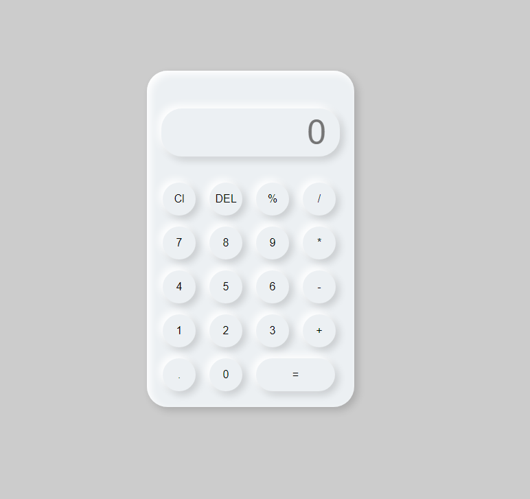
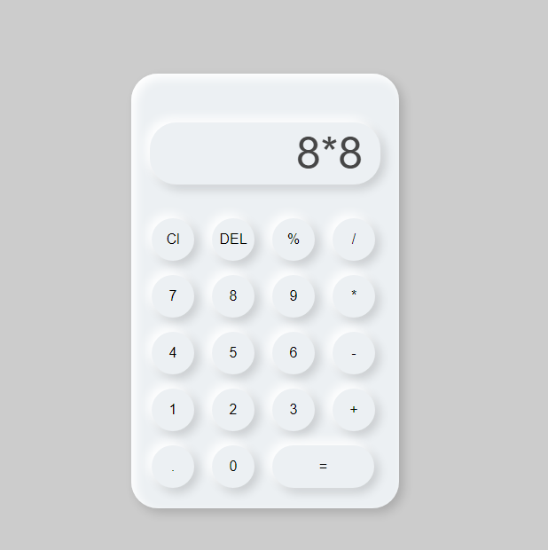
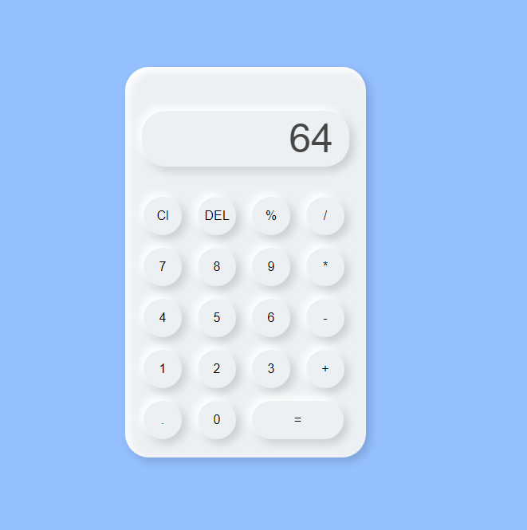

# Neumorphic-Calcultor
It a calculator designed with HTML, CSS and JAVASCRIPT 

 1. This is the design of the calculator

    

2. This is when we pass number into it to get the result of the multiplied number

   

3. This is the result of the inputed numbers

   

